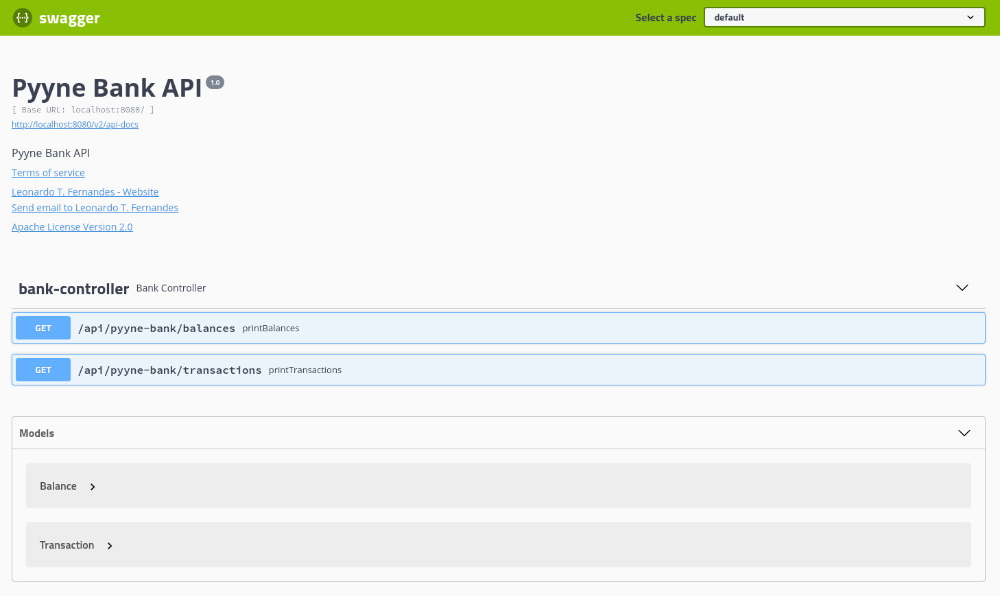
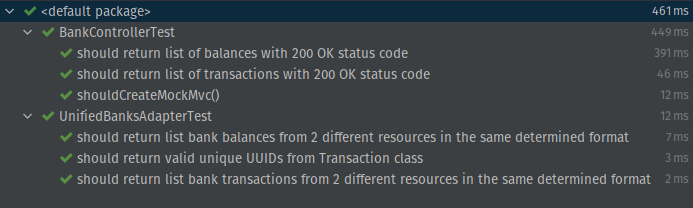

<h1 align="center">Pyyne Bank API</h1>

<p align="center">
  

  

  
</p>

Project made using the hexagonal architecture for better separation of concerns, isolation between core code and framework code and best testability.

---

### Starting

```bash
# Clone this project
$ git clone https://github.com/leodev0/pyyne-bank-api

# Access
$ cd pyyne-bank-api

# Run the project
$ mvn spring-boot:run

# The server will initialize at <http://localhost:8080>
```
---

### Documentation

- When running the project, you can check its Swagger UI documentation at: ```localhost:8080/swagger-ui.html``` or its JSON only version at ```http://localhost:8080/v2/api-docs```



---

### Tests

- You can run the tests with: ```mvn test```


